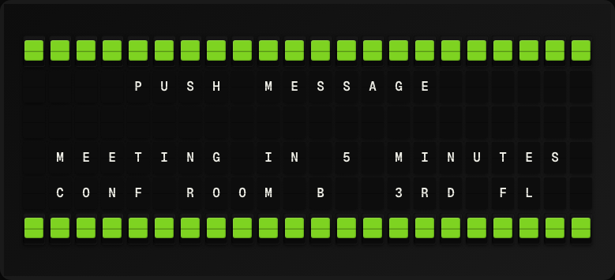

# Webhook Display Plugin

Display a custom message pushed to FiestaBoard via an HTTP webhook.



**→ [Setup Guide](./docs/SETUP.md)**

## Overview

The Webhook Display plugin exposes a local HTTP endpoint at `/api/plugins/webhook/receive`. Any system can POST a JSON payload and the board will display the configured field. Optionally verify requests with an HMAC-SHA256 secret. No external API required.

## Template Variables

| Variable | Description | Example |
|---|---|---|
| `webhook.message` | Value of the configured display field from the last payload | `Deploy success!` |
| `webhook.last_updated` | When the last webhook was received | `2026-05-01 12:00` |

## Example Templates

```
WEBHOOK
{{webhook.message}}


Updated: {{webhook.last_updated}}
```

## Configuration

| Setting | Name | Description | Required |
|---|---|---|---|
| `secret` | HMAC Secret | Optional secret to verify incoming webhooks (leave blank to disable). | No |
| `display_field` | Display Field | JSON field name from the payload to display (e.g. message). | No |
| `default_message` | Default Message | Message shown before any webhook is received. | No |

## Features

- Local HTTP webhook receiver
- Optional HMAC-SHA256 verification
- Configurable payload field
- Default message before first webhook
- No external API

## Author

FiestaBoard Team
